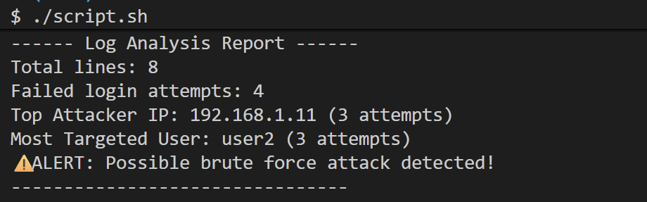

### 🔐 1. Log Intrusion Detector

A Bash-based tool to analyze log files and detect suspicious login activity.

#### 🚀 Features
- Counts total log entries
- Detects failed login attempts
- Identifies the most attacking IP
- Finds the most targeted user
- Raises alert for possible brute-force attacks

#### 🛠️ Tech Used
- Bash scripting
- grep
- awk
- sort, uniq


#### ▶️ How to Run
```bash
chmod +x script.sh
./script.sh
```

#### Sample Output
