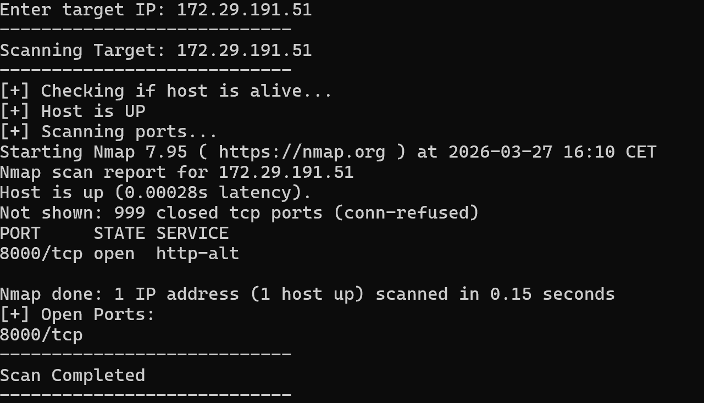

### 🌐 3. Mini Network Scanner

A Bash-based network scanning tool to identify open ports on a target system.

---

### 🚀 Features

- Accepts target IP as input
- Checks if host is reachable
- Scans open ports using Nmap
- Displays active/open ports

---

### 🛠️ Tech Used

- Bash scripting
- Nmap
- ping
- awk

---

### ▶️ How to Run

```bash
chmod +x script.sh
./script.sh
```

---

#### Sample Output
