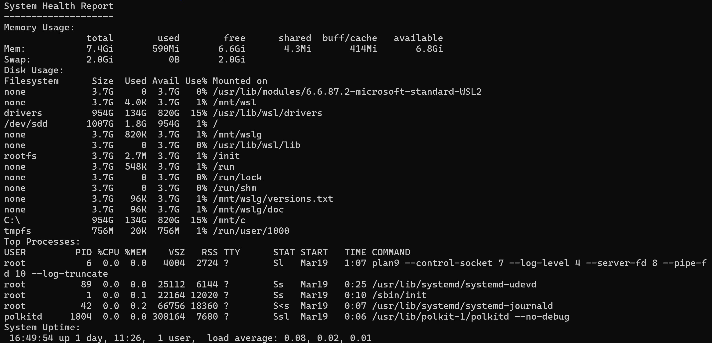

## 📊 2. System Health Monitor

A Bash-based tool to monitor system resources such as memory, disk usage, processes, and uptime.

---

### 🚀 Features

- Displays memory usage
- Shows disk space usage
- Lists top CPU-consuming processes
- Displays system uptime

---

### 🛠️ Tech Used

- Bash scripting
- Linux system commands:
  - free
  - df
  - ps
  - uptime

---

### ▶️ How to Run

```bash
chmod +x system_monitor.sh
./system_monitor.sh
```

---

#### Sample Output
